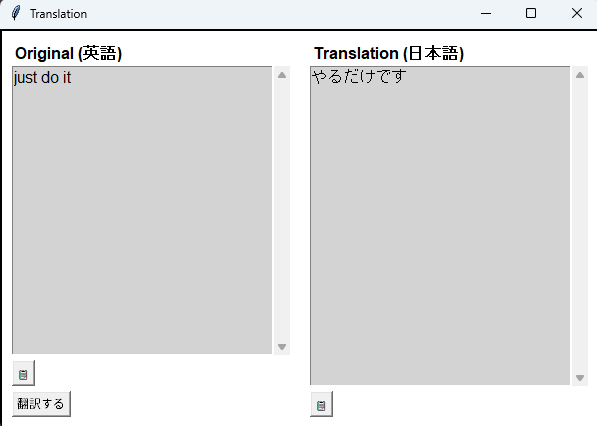

# llm_translate



**llm_translate** は、クリップボードやユーザー入力から翻訳テキストを取得し、ポップアップウィンドウで翻訳結果を表示する Windows 用アプリケーションです。  
複数の LLM プロバイダー（OpenAI、DeepSeek、Ollama）に対応しており、システムトレイのアイコンから言語の切り替えや終了が行えます。  
また、ホットキー（Ctrl+C の連打）や Shift+Enter による翻訳トリガーをサポートしています。
対象 OS: Windows 10 以降

ビルド済みバイナリはリリースページにあります。

---

## 特徴

- **複数の API プロバイダーに対応**

  - OpenAI("gpt-3.5-turbo")
  - DeepSeek("deepseek-chat")
  - Ollama

- **ユーザー入力による翻訳**

  - 翻訳元テキストエリアは編集可能
  - Shift+Enter キーまたは「翻訳する」ボタンで翻訳開始

- **クリップボード連携**

  - Ctrl+C Ctrl+C により、クリップボードの内容が自動取得され、ポップアップの翻訳元テキストエリアが更新されます
  - 翻訳結果はクリップボードにも保存

- **ポップアップウィンドウ表示**

  - 翻訳元と翻訳結果が左右に分かれて表示されます
  - ウィンドウはリサイズ可能で、テキストエリア内にスクロールバーが表示されます
  - 既存のポップアップがある場合は、翻訳元テキストが更新され、ウィンドウが前面に持ってこられます

- **システムトレイアイコン**

  - 右クリックメニューから対象言語の切り替えやアプリケーションの終了が可能

- **エラー表示**
  - 翻訳中にエラーが発生した場合、エラー内容とスタックトレースを赤字で表示

---

## 環境設定

### 環境変数の設定

本アプリケーションは、使用する API プロバイダーや各種 API キーを環境変数で設定します。以下の環境変数を設定してください。

- **LLM_TRANSLATE_API_PROVIDER**  
  使用するプロバイダーを指定します。  
  例: `openai`, `deepseek`, `ollama`

- **LLM_TRANSLATE_OPENAI_API_KEY**  
  OpenAI を使用する場合の API キー

- **LLM_TRANSLATE_DEEPSEEK_API_KEY**  
  DeepSeek を使用する場合の API キー

- **LLM_TRANSLATE_OLLAMA_MODEL**  
  Ollama を使用する場合のモデル名（例: `deepseek-r1`）

#### Windows (PowerShell)

```powershell
$env:LLM_TRANSLATE_API_PROVIDER = "openai"
$env:LLM_TRANSLATE_OPENAI_API_KEY = "YOUR_OPENAI_API_KEY"
```

#### Linux / macOS (bash)

```bash
export LLM_TRANSLATE_API_PROVIDER="openai"
export LLM_TRANSLATE_OPENAI_API_KEY="YOUR_OPENAI_API_KEY"
```

環境変数を設定した状態で、アプリケーションを実行してください。

---

## ビルド

### 依存パッケージ

`requirements.txt` に記載されているパッケージは以下の通りです。

```
pystray
keyboard
openai
pillow
pypiwin32
pyinstaller
ollama
```

以下のコマンドで一括インストールできます。

```bash
pip install -r requirements.txt
```

---

## 使用方法

1. **実行方法**  
   コマンドプロンプトまたは PowerShell で以下を実行してください。

   ```bash
   python llm_translate.py
   ```

2. **翻訳のトリガー**

   - **クリップボード連動**  
     Ctrl+C を連打（短時間に 2 回以上）すると、クリップボードの内容が取得され、既存のポップアップの翻訳元テキストエリアが更新され、翻訳結果が表示されます。
   - **ユーザー入力**  
     ポップアップの左側の翻訳元テキストエリアに直接テキストを入力し、Shift+Enter または「翻訳する」ボタンを押すと、その内容が翻訳されます。  
     ※ 翻訳実行前に右側の翻訳結果エリアには "Loading..." と表示されます。

3. **システムトレイ**  
   システムトレイに表示されるアイコンから、右クリックメニューで対象言語の切り替えやアプリケーションの終了が可能です。

---

## EXE 化

PyInstaller を使用して、単一ファイルの実行可能ファイル (exe) に変換できます。

```bash
pyinstaller --onefile --windowed llm_translate.py
```

生成された exe は `dist` フォルダ内に配置されます.

---

## ライセンス

このプロジェクトは [MIT License](LICENSE) のもとで公開されています.
